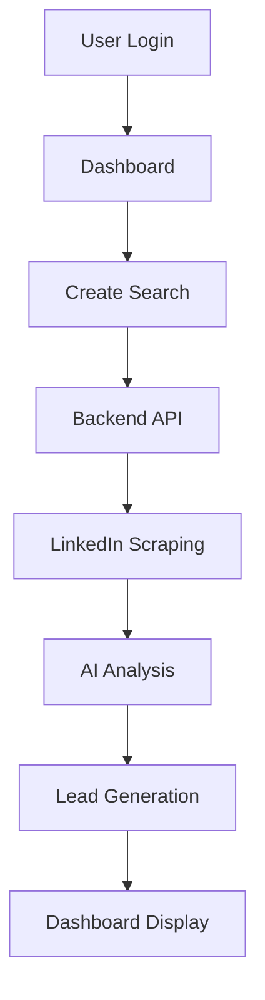

# LinkedIn Discovery Dashboard

A modern web dashboard for LinkedIn post discovery, lead generation, and analytics. Built with Astro and Tailwind CSS.

## Overview

This is the frontend dashboard that provides a user-friendly interface for the LinkedIn automation workflow. It connects to the LinkedIn Backend API to manage searches, analyze posts, track leads, and provide comprehensive analytics.

## Features

- 🔍 **Search Management** - Create and manage LinkedIn post searches
- 📋 **Post Discovery** - View discovered posts with AI-powered engagement scores
- 👥 **Lead Generation** - Track qualified leads from comment analysis
- 💾 **Inspiration Board** - Save high-performing posts for content ideas
- 📊 **Analytics Dashboard** - Comprehensive performance metrics
- ⚙️ **Settings** - Configure user profile, company info, and AI prompts
- 🔐 **Authentication** - Secure login with Clerk

## Tech Stack

- **Frontend**: Astro + HTML/CSS/JavaScript
- **Styling**: Tailwind CSS
- **Authentication**: Clerk
- **Deployment**: Vercel
- **API**: LinkedIn Backend API (linkedin-backend-api.vercel.app)

## Quick Start

### 1. Install Dependencies
```bash
npm install
```

### 2. Configure Environment
```bash
cp .env.example .env
# Edit .env with your Clerk credentials
```

Required environment variables:
```env
# Clerk Authentication
PUBLIC_CLERK_PUBLISHABLE_KEY=your_clerk_publishable_key
CLERK_SECRET_KEY=your_clerk_secret_key

# Optional: API Base URL (defaults to production)
API_BASE_URL=https://linkedin-backend-api.vercel.app/api
```

### 3. Run Development Server
```bash
npm run dev
```

The dashboard will be available at `http://localhost:4321`

## Project Structure

```text
src/
├── layouts/
│   └── Layout.astro          # Main layout with navigation
├── pages/
│   ├── index.astro           # Search dashboard  
│   ├── analytics.astro       # Analytics and metrics
│   ├── inspiration.astro     # Saved posts board
│   ├── leads.astro           # Lead management
│   ├── settings.astro        # User configuration
│   ├── sign-in.astro         # Authentication
│   └── sign-up.astro         # User registration
├── styles/
│   └── global.css            # Global styles and Tailwind
└── public/
    └── favicon.svg           # Site favicon
```

## Dashboard Pages

### 🏠 Search Dashboard (`/`)
- Create new LinkedIn searches
- View saved searches
- Execute searches and view results
- Post discovery with engagement metrics

### 📊 Analytics (`/analytics`)
- Performance overview and KPIs
- Search effectiveness metrics
- Lead generation statistics
- Conversion rate tracking

### 💡 Inspiration Board (`/inspiration`)
- Save high-performing posts
- Content idea management
- Engagement analysis
- Trend identification

### 👥 Leads (`/leads`)
- Qualified lead management
- Intent score analysis
- Lead status tracking
- Export to CSV

### ⚙️ Settings (`/settings`)
- User profile configuration
- Company information
- Target market definition
- AI tone and style prompts

## Authentication

The dashboard uses Clerk for authentication:

1. **Sign up/Sign in** required for all pages
2. **JWT tokens** automatically handled
3. **User sessions** maintained across page navigation
4. **Multi-tenant** support - each user sees their own data

## API Integration

The dashboard connects to the LinkedIn Backend API:

- **Base URL**: `https://linkedin-backend-api.vercel.app/api`
- **Authentication**: Clerk JWT tokens
- **Endpoints**: Searches, posts, leads, analytics
- **Real-time updates** from backend processing

## Features in Detail

### Search Management
- Create searches with keywords and filters
- AI-powered search optimization
- Execute searches to scrape LinkedIn
- View discovered posts with engagement scores

### Lead Generation
- AI analysis of post comments for buying intent
- Intent scoring (0.0 - 1.0)
- Lead qualification and status tracking
- Export capabilities for CRM integration

### Analytics
- Search performance metrics
- Post engagement analysis
- Lead conversion tracking
- ROI and efficiency measurements

### Content Inspiration
- Save high-performing posts
- Content pattern analysis
- Engagement benchmarking
- Trend identification

## Deployment

### Vercel Deployment

The dashboard is deployed on Vercel with the following configuration:

```json
{
  "framework": "astro",
  "buildCommand": "npm run build",
  "outputDirectory": "dist",
  "installCommand": "npm install"
}
```

### Environment Variables for Production

Set these in your Vercel dashboard:
- `PUBLIC_CLERK_PUBLISHABLE_KEY` - Clerk publishable key
- `CLERK_SECRET_KEY` - Clerk secret key
- `API_BASE_URL` - Backend API URL (optional)

## Development

### Commands

| Command                   | Action                                           |
| :------------------------ | :----------------------------------------------- |
| `npm install`             | Installs dependencies                            |
| `npm run dev`             | Starts local dev server at `localhost:4321`      |
| `npm run build`           | Build your production site to `./dist/`          |
| `npm run preview`         | Preview your build locally, before deploying     |
| `npm run astro ...`       | Run CLI commands like `astro add`, `astro check` |

### Styling

- **Tailwind CSS** for utility-first styling
- **Responsive design** for mobile and desktop
- **Dark mode ready** (can be enabled)
- **Component-based** styling approach

## Integration Workflow



## Related Repositories

- **linkedin-backend-api** - Backend API and database
- **linkedin-ai-proxy** - Simple Claude proxy for Chrome extension  
- **Linkedin** - Chrome extension for comment automation

## Contributing

1. Fork the repository
2. Create a feature branch
3. Make your changes
4. Test thoroughly
5. Submit a pull request

## License

MIT License - see LICENSE file for details